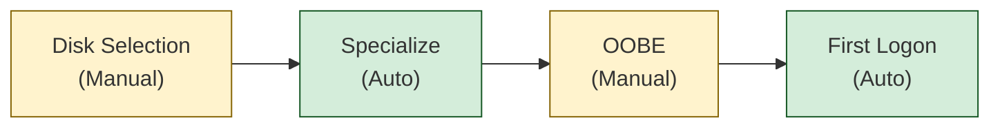

# Windows 11 Unattended Installation Toolkit

Automated Windows 11 installation using a customized `autounattend.xml` answer file.

## Components

| File | Description |
|------|-------------|
| `Setup-Win11Installer.ps1` | **One-click setup**: installs ADK, downloads ISO, creates custom installer |
| `autounattend.xml` | Answer file with embedded scripts for automated installation |
| `Get-Win11ISO.ps1` | Downloads Windows 11 ISO from Microsoft |
| `New-Win11ISO.ps1` | Creates custom ISO with embedded answer file |

## Quick Start

```powershell
# Run as Administrator - does everything automatically
.\Setup-Win11Installer.ps1
```

This will:
1. Install Windows ADK (Deployment Tools)
2. Download Windows 11 ISO from Microsoft
3. Create custom ISO with `autounattend.xml` embedded

### Use the ISO

1. Write to USB with [Rufus](https://rufus.ie/) or similar tool
2. Boot target PC from USB
3. **Manual**: Select disk/partition in Windows Setup UI
4. **Automated**: Everything else (specialize, first logon scripts)
5. **Manual**: Wi-Fi setup, user account creation during OOBE

> **Note**: Disk selection and OOBE account setup require user interaction. All other customization (debloat, Defender disable, software install) is fully automated.

## Installation Flow



| Stage | Description |
|-------|-------------|
| **Disk Selection** | Windows Setup UI for choosing disk/partition. User selects where to install. |
| **Specialize** | System configuration after image deployment. Disables Defender, removes bloatware, applies registry tweaks, enables dev features. |
| **OOBE** | Out-of-Box Experience. User connects to Wi-Fi and creates their account. |
| **First Logon** | Runs on first user login. Installs software via WinGet, applies UI theme and settings. |

### What Gets Customized

The `autounattend.xml` configures:

**During Installation (User Interaction Required):**
- **Disk**: User selects disk/partition via Windows Setup UI
- **Image**: Auto-selects "Windows 11 Pro" from install.wim/esd
- **Recovery**: Standard recovery partition is created

**During Specialize (Automated):**
- **Defender**: Disables Windows Defender services
- **8.3 Names**: Strips legacy short file names
- **Region**: Sets device region to United States (GeoID 244)
- **Debloat**: Removes pre-installed apps, capabilities, and optional features
- **Privacy**: Disables telemetry, Copilot, content delivery, SmartScreen
- **Performance**: Configures power settings, disables VBS/HVCI
- **Development**: Enables Hyper-V, WSL2, long paths
- **Updates**: Pauses Windows Update, configures active hours

**During OOBE (User Interaction Required):**
- **Wi-Fi**: User chooses network (not auto-skipped)
- **Account**: User creates Microsoft or local account

**At First Logon (Automated):**
- **Software**: Git, VS Code, .NET 10 SDK, .NET Framework 4.8.1 SDK, Chrome, Firefox (Developer Edition), PowerToys, Github Desktop, Tailscale, Rustdesk via WinGet
- **Developer Mode**: Enabled for current user
- **UI**: Dark theme, cleaned taskbar, disabled system sounds

## Customization

Edit `autounattend.xml` to modify:

- `<Extensions><File path="...">` - Embedded PowerShell scripts
- App lists in `RemovePackages.ps1`, `RemoveCapabilities.ps1`, `RemoveFeatures.ps1`
- Software list in `unattend-04.ps1`

**To make fully unattended** (skip OOBE account prompts):
1. Use [Schneegans Generator](https://schneegans.de/windows/unattend-generator/) with your desired options
2. Add a `<UserAccounts>` section under `oobeSystem > Microsoft-Windows-Shell-Setup`
3. Set `HideOnlineAccountScreens` to `true` in the OOBE section

## License

See [LICENSE](LICENSE) file.
